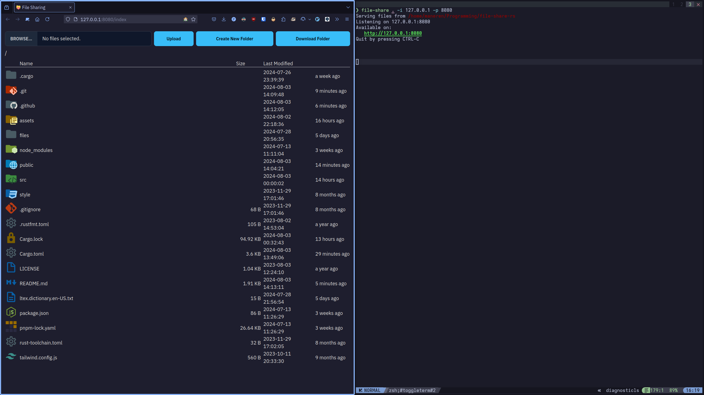

# File Share

Fast Rust-powered HTTP file server with beautiful web-based GUI

## Features

- Viewing files and folders in the web browser
- Downloading individual files
- Downloading folders as on-the-fly created archives (zip, tar, tar.gz, tar.zst)
- Creating new folders
- Uploading files
- Material Design Icons
- Blazingly fast thanks to async Rust and the [Leptos framework](https://leptos.dev/)
- Multiple instances can be run at the same time
- Allows picking the directory to share with a native GUI picker

## Preview



## Usage

```txt
Fast Rust-powered HTTP file server with beautiful web-based GUI

Usage: file-share [OPTIONS] [TARGET_DIR]

Arguments:
  [TARGET_DIR]
          Path to the directory to share

          [default: .]

Options:
  -p, --port <PORT>
          Port to listen on (use `0` to auto-pick a free port; any other busy
          port is an error)

          [default: 18765]

  -q, --qr
          Show QR codes that link to the site

  -i, --interfaces <INTERFACES>...
          IP address(es) of interfaces on which file-share will be available

          Accepts comma separated list of both IPv4 and IPv6 addresses

          [default: 0.0.0.0,::]

  -P, --picker
          Open a GUI file picker to choose the target directory

          Overrides `TARGET_DIR`

  -u, --upload
          Allow client to upload files

      --auth-token <TOKEN>
          Require a shared secret for every request

          Clients send it as `Authorization: Bearer <TOKEN>` (curl) or log in
          once via the browser form at `/login` (sets a cookie, so the web UI
          keeps working). Disabled when absent.

      --rate-limit <RPS>
          Max sustained requests per second per client IP (burst = same value)

          Excess requests get `429 Too Many Requests`. Disabled when absent.

      --max-upload-size <SIZE>
          Max request body size, e.g. `100MB`, `1GB`

          Bounds `/upload` and the browser upload endpoint; without it request
          bodies are unlimited (back-compat).

      --max-archive-size <SIZE>
          Max total bytes in one generated archive, e.g. `2GB`

          The archive stream aborts once exceeded. Disabled when absent.

      --max-archive-depth <N>
          Max directory depth included in archives

          Deeper trees are rejected before streaming starts. Disabled when
          absent.

      --archive-timeout <SECS>
          Max seconds spent generating one archive

          The stream aborts once exceeded. Disabled when absent.

  -h, --help
          Print help (see a summary with '-h')

  -V, --version
          Print version
```

## Installation

Download the binary from GitHub Releases and put it in `$PATH`.

## Compilation

You'll need [`cargo-leptos`](https://github.com/leptos-rs/cargo-leptos). You can
get it either by compiling it from the source or downloading a binary using
[`cargo-binstall`](https://github.com/cargo-bins/cargo-binstall).

```sh
cargo install cargo-leptos
# or
cargo binstall cargo-leptos
```

Then run `cargo leptos build --release` and the binary will be under `target/release/file-share`.

## License

The source code is licensed under the MIT license.

## Credits

The files and folders icons are [Material Design Icons](https://pictogrammers.com/library/mdi)
licensed under Apache License 2.0 from <https://pictogrammers.com/>.

The app icon is from
[File sharing icons created by smashingstocks - Flaticon](https://www.flaticon.com/free-icons/file-sharing "file sharing icons")
